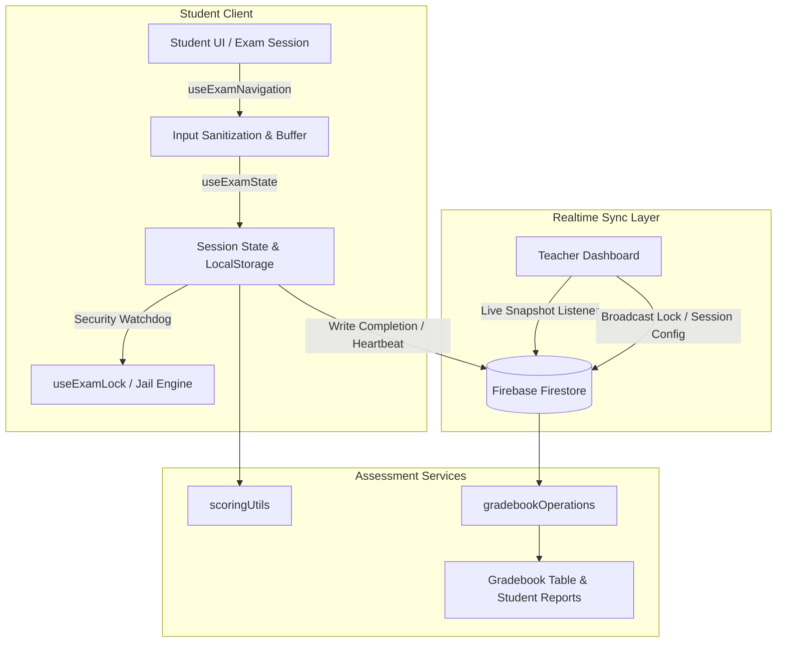

<div align="center">

# Math App (v3.4)

An adaptive, real-time assessment platform and live classroom orchestration engine built with Next.js and Firebase.

[](https://mrcastro.vercel.app)
[](https://nextjs.org/)
[](https://firebase.google.com/)
[](https://playwright.dev/)
[](#)

[**Live Application →**](https://mrcastro.vercel.app)

</div>

---

## ⚡ Key Highlights

- **Real-Time Student Sync:** Live multi-client session management and status tracking via Firebase Firestore snapshots.
- **Classroom Lock & Jail System:** Built-in kiosk-style lock controls, focus detection, and teacher-administered PIN unlock mechanisms (`2026`).
- **Adaptive Question Engine:** Real-time routing, dynamic difficulty filtering, input sanitization, and multiple-choice answer mapping.
- **Instant Gradebook & Report Suite:** Automated scoring calculations, attempt tracking, print-ready PDF/sheet generators, and parent reports.
- **Automated CI/CD Pipeline:** End-to-end browser test automation via Playwright with native Next.js build-cache in GitHub Actions.

---

## 🏛 Architecture Overview



---

## 🛠 Tech Stack

| Domain          | Technology                                                |
| :-------------- | :-------------------------------------------------------- |
| **Framework**   | Next.js (App Router, React 19 / 18)                       |
| **Styling**     | Modular CSS & Tailwind CSS                                |
| **Data & Auth** | Firebase Firestore (Realtime DB), Firebase Authentication |
| **Testing**     | Playwright E2E Suite, GitHub Actions CI Pipeline          |
| **Hosting**     | Vercel Serverless Platform                                |

---

## 🚀 Getting Started

### Prerequisites

- Node.js 18+
- npm or pnpm

### 1. Clone & Install

```bash
git clone https://github.com/mrcastrotms/math-mayan-app.git
cd math-mayan-app
npm install
```

### 2. Environment Configuration

Create a `.env.local` file in the root directory:

```env
NEXT_PUBLIC_FIREBASE_API_KEY=your_api_key
NEXT_PUBLIC_FIREBASE_AUTH_DOMAIN=your_auth_domain
NEXT_PUBLIC_FIREBASE_PROJECT_ID=your_project_id
NEXT_PUBLIC_FIREBASE_STORAGE_BUCKET=your_storage_bucket
NEXT_PUBLIC_FIREBASE_MESSAGING_SENDER_ID=your_sender_id
NEXT_PUBLIC_FIREBASE_APP_ID=your_app_id
```

### 3. Run Development Server

```bash
npm run dev
```

Visit [`http://localhost:3000`](http://localhost:3000) in your browser.

---

## 🧪 Testing Suite

Automated end-to-end tests run across Chromium, Firefox, and WebKit using Playwright:

```bash
# Run all end-to-end tests
npx playwright test

# Run unit tests for pure utilities
npm run test:unit

# Run tests in interactive UI mode
npx playwright test --ui

# Inspect HTML report
npx playwright show-report
```

---

## 📂 Core Directory Map

```text
src/
├── app/                  # Next.js App Router entry points & global styles
├── components/           # UI views, student keypad, modals, and gradebook tables
├── data/                 # Static fallback question bank and standards mapping
├── hooks/                # Core hooks (useExamState, useExamNavigation, useTimer)
├── services/             # Firebase live sync and gradebook operation drivers
├── styles/               # Styling configurations and shared theme tokens
└── utils/                # Pure scoring math, session handling, and sanitizers
```

### Managing class sections

Teachers can add or remove sections from **Teacher Dashboard > Class Sections**.
Each section has an accessible `Delete section <name>` control. Deletion requires
confirmation and persists the complete updated list to the Firestore document
`settings/classes` under the `list` field. The local cache is refreshed by the
existing app configuration flow.

### Themes and accessibility

The application supports `Standard`, `Dark`, `Sepia`, and `High Contrast` themes.
The selected theme is stored in `localStorage` as `math_app_theme`, applied to
`<html data-theme="...">` before the app renders, and backed by global CSS
variables and visible focus rings. High Contrast uses a black/white palette with
yellow focus indicators for low-vision users.

Teachers can use **Teacher Dashboard > Theme Enforcement** to broadcast the
selected theme to active students in the current section. The broadcast updates
each matching `activeSessions/{studentUid}` Firestore document with
`{ enforcedTheme, themeLocked }`. Students receive the update through a
Firestore snapshot listener; their theme controls are disabled and an accessible
“Theme locked by teacher” status is shown until the teacher releases the lock.

Theme unit tests run with Node's built-in test runner. Browser coverage validates
theme persistence and the teacher controls:

```bash
npm run test:unit
npx playwright test tests/theme-accessibility.spec.js
```

### Assigned classwork

Teachers can post section-specific worksheets from **Teacher Dashboard > Assign
Classwork**. Enter one question per line as `prompt | answer`, choose a due
date/time, review the generated answer key, and explicitly publish it to
Firestore's `worksheets` collection. Drafts are not visible to students.
Prompts render with textbook-style math typography, including superscripts,
radicals, and multiplication symbols. Students see
matching work in **Assigned Work** on phones and desktop layouts. Answers are
debounced and saved to `worksheet_attempts/{worksheetId}_{studentId}`, so
students can leave after any question and resume later on another device using
the same device identity.

Submitting (or reaching the deadline) scores every question, records partial
completion, and writes a `Classwork` entry to `exam_results`; the existing
Gradebook activity filter therefore includes worksheet grades without a second
grading path. Closed assignments cannot be edited or submitted.

The builder also accepts a phone camera or image upload. The image is sent to
`/api/worksheets/digitize`, where Gemini Vision returns editable question
records; teachers must review the generated prompt and answer text before
posting. Student worksheets provide up to four Socratic hints per saved
attempt, disable the hint action after the quota, and save the hint count with
the attempt. The existing `/api/ai/hint` enforces the four-request server-side quota before calling
Gemini and returns a progressive Socratic hint without the final answer.

The worksheet workspace uses a focused one-question-at-a-time layout with
student/section context, a deadline countdown, theme-lock support,
previous/next navigation, touch-friendly input, and an accessible four-hint
quota. Gradebook reports preserve every submitted item, classwork title,
answered/correct totals, and hint usage; the existing QR report URL and batch
print flow remain available.

### Live worksheet classroom controls

Worksheet sessions request fullscreen and show a recovery control if fullscreen
or window focus is lost. A loss of focus records one demerit in the student's
`activeSessions/{studentUid}` document and displays the existing lock overlay.
The header subscribes to the same document for live merits and demerits.
Teachers can award either value from each Live Classroom student card.

Forward navigation is intentionally answer-gated: blank questions cannot be
skipped, while previous questions remain available for review. The worksheet
keypad includes `+`, `-`, `×`, and `÷`; exponent controls appear only for
exponent-enabled work (`type: "exponent"` or `gradeLevel: 5`).

The **Assigned Work Manager** lets teachers refresh assignments, clone work to
another section, edit a deadline, or revoke a published assignment without
deleting its history.

### Student dashboard sizing and Standard theme

The student activity dashboard uses large, padded controls with a minimum
6rem height and larger supporting text so the primary destinations are usable
on tablets and phones. The Standard theme explicitly declares a light color
scheme, dark foreground (`#0f172a`), white surface, and dark focus color;
shared light-surface utilities inherit those values to prevent text from
washing out against the background.

Worksheet answers are normalized before grading so whitespace, multiplication
symbols (`x`, `×`, `·`, `⋅`), division symbols (`÷`, `⁄`), Unicode minus
variants, and thousands separators do not cause equivalent answers to be
marked incorrect. Exponent-enabled questions use the extended touch keypad,
which provides large, accessible number/operator buttons for `+`, `-`, `×`,
`÷`, and `^`; standard arithmetic keeps the compact numeric keypad.

The teacher assignment manager provides **Clone**, **Edit**, **Unassign**, and
**Delete** actions. Edit changes the due date, Unassign revokes publication
without removing history, and Delete permanently removes the worksheet record.
The manager and theme-enforcement cards use opaque active-theme surfaces rather
than translucent backgrounds so Standard-theme text remains readable.

On phone-sized screens, Student Home moves the theme choices and Reset Session
action into a fixed, safe-area-aware bottom navigation bar. The welcome card,
activity buttons, and assigned-work panel use contained flex/grid layouts with
wrapping long text so assigned work cannot widen the page or introduce
horizontal scrolling. Desktop retains the existing top-row theme controls.

The lock overlay countdown uses an absolute deadline and a stable unlock
callback, so its 45-second grace timer continues to tick even when the parent
component re-renders. Math expressions convert literal `\;` spacing to
explicit KaTeX `\text{ }` spacing before rendering.

### Multi-part worksheets

Worksheets use `schemaVersion: 2` and support a `parts` array. Each part has an
`id`, `title`, `instruction`, and `questions`; the persisted top-level
`questions` array remains available for backwards compatibility and is
normalized from the parts. Each question receives a `partId`, allowing the
student workspace to show the correct part instruction immediately above the
question group.

Teachers can add Part/Section blocks in the builder or paste JSON such as:

```json
{
  "schemaVersion": 2,
  "parts": [
    {
      "id": "part-a",
      "title": "Part A",
      "instruction": "Write the exponent",
      "questions": [
        {
          "id": "a1",
          "prompt": "2^3",
          "correctAnswer": "8",
          "acceptedAnswers": ["8"]
        }
      ]
    }
  ]
}
```

Imported or generated content always remains in the teacher answer-key review
step before publication. The dashboard's **Student Version** action returns to
the Exam Gate; after the reset limit is reached, `0801` and `2026` are accepted
teacher reset codes.

Teacher access is session-scoped: entering `0801` or `2026` in the Exam Gate
teacher modal sets the dashboard authorization for the current browser session,
so the Dashboard does not ask for the same code again. Direct dashboard access
uses the same in-app modal rather than a browser prompt. The Gradebook summary
card opens the live Gradebook view, and Student Version clears the teacher
session and returns to the Exam Gate.

PIN entry fields are intentionally plain text controls with browser autocomplete
disabled; they are access codes, not saved account passwords. Student names are
entered manually without roster dropdown suggestions, then resolved against the
selected section roster asynchronously when the student starts.

Teacher-generated five-character session codes remain required for timed exams.
After reaching Student Home, a student must enter the active teacher code before
the exam starts; Firestore supplies the session duration and activity type. On
submission, the saved Gradebook record ID is included in the parent Gmail link
so families can open the complete report.

The teacher dashboard also includes an Attendance Book and Behavior & Values
Book. Student Home presence is recorded in Firestore with heartbeats; a student
is marked present after remaining in the session for at least ten minutes.
Behavior session records persist merits and demerits beyond the live-session
document, and the teacher view calculates a relative daily score from 70% to
100% based on net merits.

Each dashboard book links to **Attendance & Values History**. This complete
Firestore-backed report loads records across dates, combines attendance days
with merits, demerits, and relative values scores per student, and supports
exact-date and grade filters. Its attendance trend graph summarizes qualifying
students by day so historical reports remain available after the current day.
The report also has a section filter, so Grade 4A and Grade 4B can be reviewed
as separate cohorts rather than combined.

Teacher Dashboard cards share the active theme surface, border, and foreground
tokens, and the dashboard uses a consistent gap between every card. The
historical report is centered in its own responsive page shell; fixed-width
tables scroll inside the report rather than widening the dashboard.

During production exams, leaving fullscreen, switching tabs/windows, using
browser back navigation, or triggering an unload activates the lock workflow.
The lock state is persisted in session storage, and horizontal overscroll is
disabled while the exam is active to reduce accidental laptop touchpad swipe
navigation. Tester/bypass sessions intentionally skip enforcement so local
development remains usable; normal verified student sessions use the guards.

Browser zoom remains available. The exam surface uses `pan-y pinch-zoom`
instead of disabling touch gestures, so Mac trackpad pinch, Lenovo touchpad
zoom where supported by the browser/driver, and touchscreen pinch-to-zoom can
still enlarge small text. Only horizontal page navigation is constrained.
Classwork and exam answer panels include an extended math keypad with `+`, `−`,
`×`, `÷`, and `^`; exponent-enabled classwork also exposes the exponent key
for repeated multiplication and powers.

## 🛡️ Git Workflow & Branch Protections

- Direct pushes to `develop` and `main` are disabled.
- All feature additions must originate from `feature/<name>` branches.
- Automated agents and human contributors must submit Pull Requests into `develop`.
- For details, review [CONTRIBUTING.md](./CONTRIBUTING.md).
