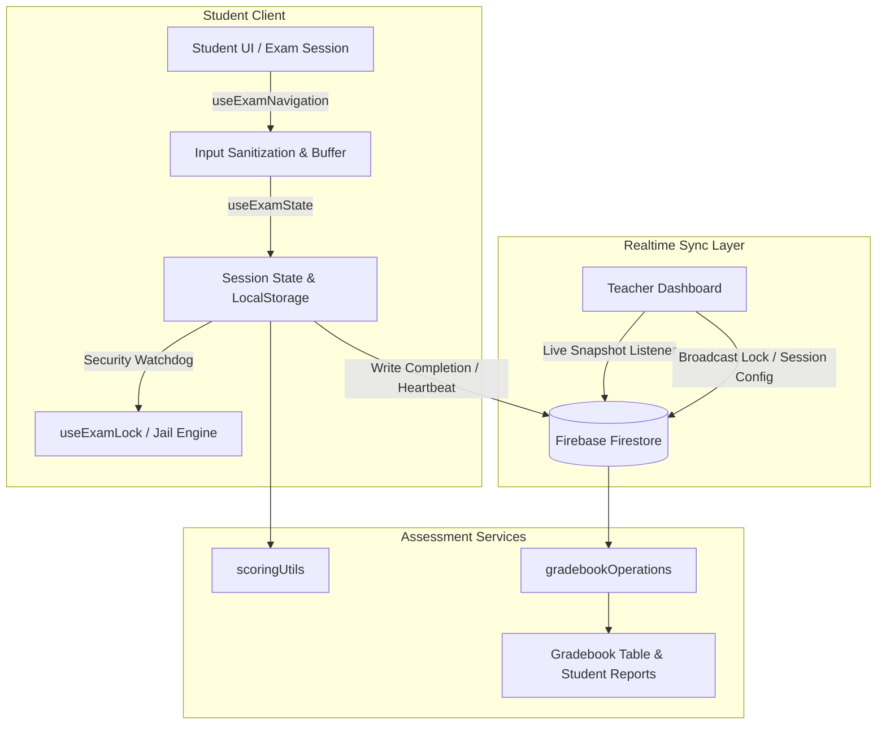

<div align="center">

# 📐 Math Mayan App (v3.4)

An adaptive, real-time assessment platform and live classroom orchestration engine built with Next.js and Firebase.

[](https://mrcastro.vercel.app)
[](https://nextjs.org/)
[](https://firebase.google.com/)
[](https://playwright.dev/)
[](#)

[**Live Application →**](https://mrcastro.vercel.app)

</div>

---

## ⚡ Key Highlights

* **Real-Time Student Sync:** Live multi-client session management and status tracking via Firebase Firestore snapshots.
* **Classroom Lock & Jail System:** Built-in kiosk-style lock controls, focus detection, and teacher-administered PIN unlock mechanisms (`2026`).
* **Adaptive Question Engine:** Real-time routing, dynamic difficulty filtering, input sanitization, and multiple-choice answer mapping.
* **Instant Gradebook & Report Suite:** Automated scoring calculations, attempt tracking, print-ready PDF/sheet generators, and parent reports.
* **Automated CI/CD Pipeline:** End-to-end browser test automation via Playwright with native Next.js build-cache in GitHub Actions.

---

## 🏛 Architecture Overview



---

## 🛠 Tech Stack

| Domain | Technology |
| :--- | :--- |
| **Framework** | Next.js (App Router, React 19 / 18) |
| **Styling** | Modular CSS & Tailwind CSS |
| **Data & Auth** | Firebase Firestore (Realtime DB), Firebase Authentication |
| **Testing** | Playwright E2E Suite, GitHub Actions CI Pipeline |
| **Hosting** | Vercel Serverless Platform |

---

## 🚀 Getting Started

### Prerequisites

* Node.js 18+ 
* npm or pnpm

### 1. Clone & Install

```bash
git clone https://github.com/mrcastrotms/math-mayan-app.git
cd math-mayan-app
npm install
```

### 2. Environment Configuration

Create a `.env.local` file in the root directory:

```env
NEXT_PUBLIC_FIREBASE_API_KEY=your_api_key
NEXT_PUBLIC_FIREBASE_AUTH_DOMAIN=your_auth_domain
NEXT_PUBLIC_FIREBASE_PROJECT_ID=your_project_id
NEXT_PUBLIC_FIREBASE_STORAGE_BUCKET=your_storage_bucket
NEXT_PUBLIC_FIREBASE_MESSAGING_SENDER_ID=your_sender_id
NEXT_PUBLIC_FIREBASE_APP_ID=your_app_id
```

### 3. Run Development Server

```bash
npm run dev
```

Visit [`http://localhost:3000`](http://localhost:3000) in your browser.

---

## 🧪 Testing Suite

Automated end-to-end tests run across Chromium, Firefox, and WebKit using Playwright:

```bash
# Run all end-to-end tests
npx playwright test

# Run tests in interactive UI mode
npx playwright test --ui

# Inspect HTML report
npx playwright show-report
```

---

## 📂 Core Directory Map

```text
src/
├── app/                  # Next.js App Router entry points & global styles
├── components/           # UI views, student keypad, modals, and gradebook tables
├── data/                 # Static fallback question bank and standards mapping
├── hooks/                # Core hooks (useExamState, useExamNavigation, useTimer)
├── services/             # Firebase live sync and gradebook operation drivers
├── styles/               # Styling configurations and shared theme tokens
└── utils/                # Pure scoring math, session handling, and sanitizers
```
